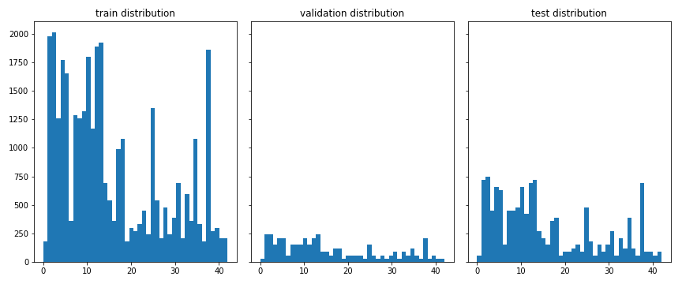
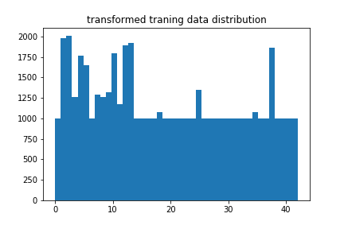

# **Traffic Sign Recognition** 

**Build a Traffic Sign Recognition Project**

The goals / steps of this project are the following:
* Load the data set (see below for links to the project data set)
* Explore, summarize and visualize the data set
* Design, train and test a model architecture
* Use the model to make predictions on new images
* Analyze the softmax probabilities of the new images
* Summarize the results with a written report

### Data Set Summary & Exploration

#### 1. Provide a basic summary of the data set.

I used the numpy library to calculate summary statistics of the traffic
signs data set:

* The size of training set is 34799
* The size of the validation set is 4410
* The size of test set is 12630
* The shape of a traffic sign image is (32,32,3)
* The number of unique classes/labels in the data set is 43

#### 2. Include an exploratory visualization of the dataset.

Here is an exploratory visualization of the data set. It is a histogram showing how the data are distributed

### Design and Test a Model Architecture

#### 1. Describe how you preprocessed the image data. What techniques were chosen and why did you choose these techniques? Consider including images showing the output of each preprocessing technique. Pre-processing refers to techniques such as converting to grayscale, normalization, etc. (OPTIONAL: As described in the "Stand Out Suggestions" part of the rubric, if you generated additional data for training, describe why you decided to generate additional data, how you generated the data, and provide example images of the additional data. Then describe the characteristics of the augmented training set like number of images in the set, number of images for each class, etc.)

Because the distribution of the training data is not even, some of the labels have very low amount, I didn't fix this at the first time, and later I came back to fix this to improve the performance. For those labels less than 1000, I generate additional data by small random perturbation of the image like random translate and random warp. As a result, the minimum number of labels is 1000. Actually it significantly increase the accuracy of the validation set. Then augmented data has the following distribution.

I also did the simple preprocessing techniques like converting to grayscale and normalization ((image-128)/128).

#### 2. Describe what your final model architecture looks like including model type, layers, layer sizes, connectivity, etc.) Consider including a diagram and/or table describing the final model.

My final model consisted of the following layers:

| Layer         		    |     Description	        				            	| 
|:---------------------:|:---------------------------------------------:| 
| Input         	     	| 32x32x1 grayscale image   				            | 
| Convolution 5x5     	| 2x2 stride, valid padding, outputs 28x28x6  	|
| RELU					        |												                        |
| Max pooling	         	| 2x2 stride,  outputs 14x14x6 				          |
| Convolution 5x5	      | 2x2 stride, valid padding, outputs 10x10x16   |
| RELU		              |        									                      |
| Max polling			      | 2x2 stride,  outputs 5x5x16        		      	|
| Flatten				        |											                        	|
| Fully connected	    	| input 400, output 120							            |
| RELU                  |                                               |
| Dropout               | keep probability: 0.5                         |
| Fully connected       | input 120, output 84                          |
| Dropout               | keep probability: 0.5                         |
| Fully connected       | input 84, output 43                           |

#### 3. Describe how you trained your model. The discussion can include the type of optimizer, the batch size, number of epochs and any hyperparameters such as learning rate.

To train the model, I used the LeNet mostly given by the course, but I add dropout layers in first and second fully connected layers. I used the AdamOptimizer with a learning rate of 0.0009. The epochs and batch size are 20 and 128.

#### 4. Describe the approach taken for finding a solution and getting the validation set accuracy to be at least 0.93. Include in the discussion the results on the training, validation and test sets and where in the code these were calculated. Your approach may have been an iterative process, in which case, outline the steps you took to get to the final solution and why you chose those steps. Perhaps your solution involved an already well known implementation or architecture. In this case, discuss why you think the architecture is suitable for the current problem.

My final model results were:
* training set accuracy of 0.993
* validation set accuracy of 0.970 
* test set accuracy of 0.941

If an iterative approach was chosen:
* What was the first architecture that was tried and why was it chosen?
  my first architecture is the original lenet without dropout
* What were some problems with the initial architecture?
  the training accuracy were very high, but the validation accuracy is not high.
* How was the architecture adjusted and why was it adjusted?
  Because the difference between training and validation accuracy shows there's overfitting, so either I would normalize the parameter or use dropout technique, so added droput layer in the first and second fully connected layer with keep probability to be 0.5
* Which parameters were tuned? How were they adjusted and why?
  The learning rate changed from 0.001 to 0.0009, because I thought a smaller learning rate can increase the learning speed some time. Also the batch size changed from 10 to 30, because I saw the accuracy is still increasing.
* What are some of the important design choices and why were they chosen? For example, why might a convolution layer work well with this problem? How might a dropout layer help with creating a successful model?
  I think the most important design here is to generate more training data, because the original unbalanced data will bias to those big classes, and will affect the performance on the small classes, with out this step, the validation accuracy was fluctuating around 0.93 even I increased the epochs to 100.
  
### Test a Model on New Images

#### 1. Choose five German traffic signs found on the web and provide them in the report. For each image, discuss what quality or qualities might be difficult to classify.

Here are five German traffic signs that I found on the web:

   
 

#### 2. Discuss the model's predictions on these new traffic signs and compare the results to predicting on the test set. At a minimum, discuss what the predictions were, the accuracy on these new predictions, and compare the accuracy to the accuracy on the test set (OPTIONAL: Discuss the results in more detail as described in the "Stand Out Suggestions" part of the rubric).

Here are the results of the prediction:

| Image			        |     Prediction	        					| 
|:---------------------:|:---------------------------------------------:| 
| Speed limit (30km/h)  | Stop sign   									| 
| Bumpy road     		| Bumpy road 									|
| Ahead only			| Ahead only									|
| No vehicles	      	| Speed limit (30km/h)					 		|
| Go straight or left	| Go straight or left     						|

The accuracy here is only 0.8 when I run on workspace, the forth one failed to ditect the white in circle.

Actually the model correctly guess all the 5 traffic signs when running locally in my machine, which gives an accuracy of 100%, I don't get why it predicted the forth image wrong here.

#### 3. Describe how certain the model is when predicting on each of the five new images by looking at the softmax probabilities for each prediction. Provide the top 5 softmax probabilities for each image along with the sign type of each probability. (OPTIONAL: as described in the "Stand Out Suggestions" part of the rubric, visualizations can also be provided such as bar charts)

The code for making predictions on my final model is located in the 11th cell of the Ipython notebook.

For the first image, the model is quite sure that this is a speed limit (30km/h) (probability of 1.0). The top five soft max probabilities were

| Probability         	|     Prediction	        					| 
|:---------------------:|:---------------------------------------------:| 
| 1.0         			| Speed limit (30km/h)   						| 
| 0.0     				| Speed limit (20km/h)							|
| 0.0					| Speed limit (70km/h)							|
| 0.0	      			| Speed limit (50km/h)							|
| 0.0				    | Go straight or left      				     	|

For the second image, the model is quite sure that this is a Bumpy road (probability of 1.0). The top five soft max probabilities were  

| Probability         	|     Prediction	        					| 
|:---------------------:|:---------------------------------------------:| 
| 1.0         			| Bumpy road   									| 
| 0.0     				| Bicycles crossing 							|
| 0.0					| Road work										|
| 0.0	      			| No vehicles					 				|
| 0.0				    | Yield      							        |

For the third image, the model is quite sure that this is a Ahead only (probability of 1.0). The top five soft max probabilities were  

| Probability         	|     Prediction	        					| 
|:---------------------:|:---------------------------------------------:| 
| 1.0         			| Ahead only   									| 
| 0.0     				| Turn left ahead 								|
| 0.0					| Speed limit (60km/h)							|
| 0.0	      			| No vehicles					 				|
| 0.0				    | No passing      							    |

For the forth image, the model didn't predict it correctly (probability of 0.24), and not sure of any prediction. The top five soft max probabilities were 

| Probability         	|     Prediction	        					| 
|:---------------------:|:---------------------------------------------:| 
| 0.24         			| Speed limit (30km/h)  						| 
| 0.20     				| Roundabout mandatory 							|
| 0.09					| Speed limit (20km/h)							|
| 0.09	      			| Traffic signals					 			|
| 0.37				    | Speed limit (50km/h)      					|

For the fifth image, the model is quite sure that this is a Go straight or left (probability of 1.0). The top five soft max probabilities were   

| Probability         	|     Prediction	        					| 
|:---------------------:|:---------------------------------------------:| 
| 1.00         			| Go straight or left   						| 
| 0.00     				| Roundabout mandatory							|
| 0.00					| Speed limit (20km/h)							|
| 0.00	      			| Keep left					 				    |
| 0.00				    | Traffic signals     							|
